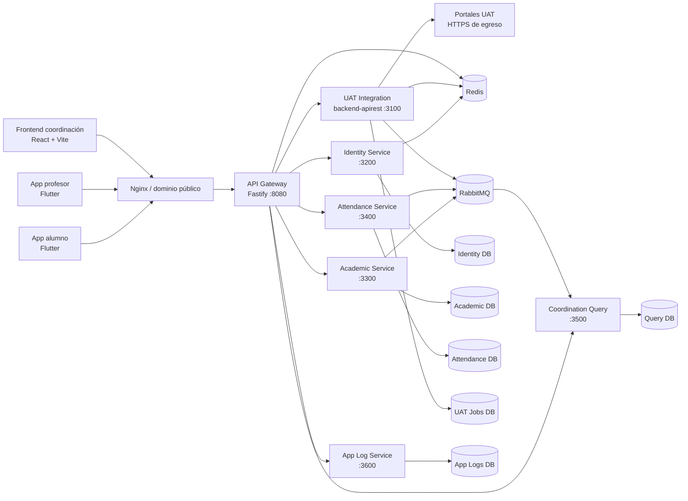
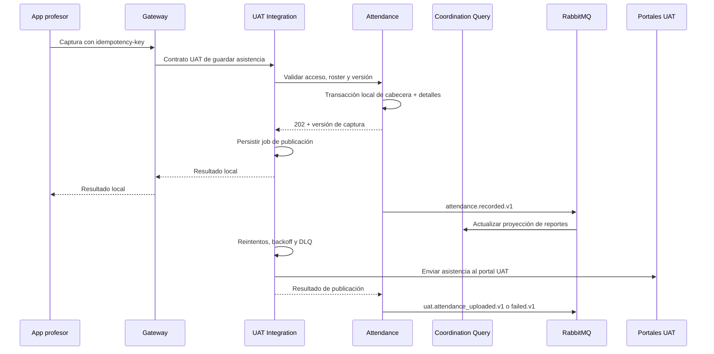

# Presencia: visión general del proyecto

## Qué es

Presencia es una plataforma de control y seguimiento de asistencia para la
Universidad Autónoma de Tamaulipas (UAT). Conecta tres experiencias:

- la aplicación del profesor, para consultar grupos y pasar lista;
- la aplicación del alumno, para identificarse y anunciar su presencia por
  Bluetooth Low Energy (BLE);
- el portal web de coordinación, para supervisar carga académica, asistencia,
  dispositivos, salones y reportes.

El sistema se integra con los portales institucionales de la UAT. La
plataforma conserva una copia operativa de la información necesaria para que
una clase ya sincronizada pueda abrirse y registrar asistencia aunque el portal
UAT o la conexión estén temporalmente indisponibles. Cuando la conectividad se
recupera, las operaciones pendientes se reintentan de forma idempotente.

## Qué problema resuelve

El proyecto sustituye procesos dispersos y manuales por un flujo único para:

1. autenticar profesores, alumnos y personal de coordinación;
2. sincronizar profesores, grupos, horarios y padrones desde UAT;
3. identificar la presencia del profesor y, opcionalmente, de los alumnos por
   proximidad BLE/beacon;
4. registrar asistencia manual o automática sin depender de la hora del
   teléfono;
5. consultar el historial y generar reportes semanales o por rango;
6. administrar sustituciones, clases compartidas, beacons y vínculos de
   dispositivos;
7. conservar logs diagnósticos móviles sin almacenar contraseñas ni tokens.

## Arquitectura en una vista



El despliegue mantiene todos los servicios internos en una red privada. El
único punto de entrada de las aplicaciones es el Gateway; los servicios no
reciben dominios públicos. En Dokploy, `frontend-coord` sirve la interfaz y su
Nginx reenvía las rutas de API al Gateway.

## Componentes principales

| Componente | Tecnología | Responsabilidad |
| --- | --- | --- |
| `app-profesor` | Flutter/Dart, Riverpod, Dio, Hive, BLE | Login, sincronización de grupos, asistencia manual y automática, escaneo de salones/alumnos y cola offline. |
| `app-alumno` | Flutter/Dart, Hive, almacenamiento seguro y BLE | Login del alumno, vínculo de dispositivo, horario/perfil, anuncio BLE y confirmación/historial de asistencia. |
| `frontend-coord` | React 19, TypeScript, Vite, React Query, Zustand | Dashboard, reportes, carga académica, clases compartidas, sustituciones, beacons, vínculos y superusuario. |
| `api-gateway` | Node.js 24, Fastify | Entrada única, CORS, rate limit, límites de cuerpo, correlation ID, trazas y proxy hacia el propietario de cada ruta. |
| `identity-service` | Fastify, Prisma, PostgreSQL, Redis, Argon2/JWT | Identidades, roles, sesiones revocables, cuentas de coordinación, superusuario y auditoría. |
| `academic-service` | Fastify, Prisma, PostgreSQL, RabbitMQ | Ciclos, profesores, grupos, horarios, roster, clases compartidas y sustituciones. |
| `attendance-service` | Fastify, Prisma, PostgreSQL, RabbitMQ | Capturas, entradas/salidas, observaciones BLE, beacons de salón, vínculos de dispositivo y configuración de asistencia. |
| `coordination-query-service` | Fastify, Prisma, PostgreSQL, RabbitMQ | Modelo de lectura reconstruible para dashboard y reportes. |
| `backend-apirest` / UAT Integration | Fastify, Axios, CookieJar, Redis, RabbitMQ | Adaptador anticorrupción para los portales ASP.NET de maestros y alumnos, sesiones UAT y cargas pendientes. |
| `app-log-service` | Fastify, Prisma, PostgreSQL | Ingesta append-only, idempotente y redactada de logs móviles. |
| `demo-portal-service` | Fastify, Redis | Sustituto privado de los portales para datos y simulaciones de demo; no es un dominio público. |
| PostgreSQL, Redis y RabbitMQ | Contenedores Docker | Persistencia separada por servicio, sesiones/caché y eventos durables con reintentos/DLQ. |

### Estado de la migración

La plataforma se está migrando de forma incremental mediante *strangler
pattern*. `backend/` es la implementación histórica del backend y conserva
modelos, migraciones y scripts de compatibilidad; `backend-apirest/` es el
adaptador de integración UAT que continúa siendo necesario para los contratos
de las apps. Las rutas públicas se mantienen estables mientras el Gateway va
trasladando su propietario al servicio nuevo. Ningún servicio nuevo debe leer
tablas de otro servicio directamente.

## Rutas públicas del Gateway

El contrato público vigente está definido en
`packages/contracts-http/src/index.ts`:

| Prefijo | Uso | Propietario final |
| --- | --- | --- |
| `/api/uat` | Sesiones UAT, horarios, carreras, calificaciones y compatibilidad de apps | UAT Integration |
| `/api/coordinacion` | Dashboard, reportes, carga y administración de coordinación | Coordination Query + servicios propietarios |
| `/api/student-device-bindings` | Reconciliación del vínculo del celular del alumno | Attendance |
| `/api/app-logs` | Envío de lotes diagnósticos móviles | App Log Service |
| `/api/superUsuario` | Administración, beacons, cuentas, debug y logs | Identity/Attendance/Coordination vía UAT Integration |

`/internal/*` nunca se expone a los clientes. El Gateway rechaza esas rutas y
los servicios internos exigen `x-internal-service-token`.

## Flujos funcionales

### 1. Profesor: autenticación y carga académica

1. `app-profesor` envía usuario y contraseña al contrato `/api/uat`.
2. UAT Integration abre el portal UAT, obtiene y conserva temporalmente el
   `CookieJar` ASP.NET en Redis con TTL; la contraseña sólo vive durante la
   autenticación.
3. El servicio importa el snapshot académico y lo envía a Academic, que hace
   *upsert* por identificadores externos estables y actualiza el roster sin
   borrar historial.
4. La app recibe grupos y horarios, los mantiene en su caché local y muestra el
   progreso de sincronización. Si el canal SSE se corta, consulta el estado
   real de la sincronización y puede continuar.

### 2. Alumno: login, vínculo y presencia

1. `app-alumno` genera o recupera un `attendanceUuid` y un identificador de
   instalación.
2. Envía ambos junto con las credenciales a
   `/api/uat/alumnos/sessions`. UAT valida al alumno y Attendance registra el
   primer vínculo.
3. El backend devuelve una sesión temporal y un token de vínculo; el UUID no
   puede cambiarse desde la app. Un cambio requiere autorización de
   coordinación.
4. La app actualiza horario/perfil en segundo plano y anuncia la identidad por
   BLE cuando inicia una sesión de asistencia.
5. El profesor escanea los UUID configurados. Las detecciones se envían a
   Attendance, que verifica padrón, grupo y sesión antes de marcar presencia.

Los identificadores de sesión se guardan en Keystore/Keychain. La contraseña
UAT del profesor no se persiste; en la app del alumno las credenciales sólo se
usan para refrescar una sesión académica y no forman parte del log.

### 3. Captura y publicación de asistencia

La captura se acepta sólo si el profesor está autorizado para el grupo (titular,
sustituto o asignación válida), el alumno pertenece al roster y la versión de
la sesión es consistente.



La aplicación puede trabajar sin conexión: conserva la captura en su
almacenamiento local y la reenvía cuando hay red. El Gateway y los servicios
reconocen claves de idempotencia para que repetir la petición no duplique la
asistencia.

La entrada/salida del profesor se registra con la hora efectiva del servidor.
La detección del beacon ayuda a identificar salón y presencia, pero el cliente
no puede sustituir la hora del backend.

### 4. Coordinación, dashboard y reportes

Academic y Attendance publican eventos versionados mediante RabbitMQ. Query
consume esos eventos de forma idempotente, materializa sus propias tablas y
calcula:

- grupos, profesores y materias disponibles;
- horas programadas, tomadas, tardías, faltantes y futuras;
- cobertura por semana o rango de fechas;
- estado de publicación al portal UAT;
- beacons y vínculos operativos.

El frontend usa React Query para lecturas y mutations. Los comandos de
coordinación se envían al servicio dueño; Query no modifica bases ajenas.

### 5. Logs móviles

Ambas apps escriben primero cada evento en una cola Hive local y después lo
envían en lotes de hasta 50 a `/api/app-logs/batches`. El backend confirma cada
UUID después del commit PostgreSQL, por lo que la entrega es *at least once*
con deduplicación efectiva. Se redactan contraseñas, tokens, cookies,
credenciales, sesiones y llaves privadas. Una caída del servicio de logs no
debe impedir login ni asistencia.

## Cómo está hecho el código

### Backend y servicios

El backend nuevo usa TypeScript estricto sobre Node.js 24 y Fastify 5. Cada
servicio sigue, con pequeñas variaciones, cuatro capas:

```text
presentation/       HTTP, Fastify, esquemas Zod y health checks
application/        casos de uso y orquestación
domain/             entidades, reglas e interfaces de repositorio
infrastructure/     Prisma, Redis, RabbitMQ, configuración y adaptadores
```

Prisma genera el cliente y ejecuta migraciones independientes por base lógica.
Los contratos compartidos viven en `packages/contracts-http` y
`packages/contracts-events`; los eventos incluyen versión, `eventId`,
`correlationId` y `aggregateId`.

Patrones importantes:

- transacción local + outbox para escrituras críticas;
- eventos durables, reintentos y cola de mensajes muertos;
- consumidores idempotentes con bandeja de eventos procesados;
- snapshots de roster para validar asistencia aunque Academic no responda;
- rate limiting, Helmet, CORS explícito, límites de cuerpo y métricas;
- correlation ID y `traceparent` entre Gateway, servicios, Redis y RabbitMQ;
- health checks separados en `/health/live`, `/health/ready` y `/health`.

### Apps móviles

Las dos apps son proyectos Flutter separados. `app-profesor` está organizado
por features y usa Riverpod, Go Router, Dio, Hive y canales nativos para BLE;
`app-alumno` concentra servicios de autenticación, almacenamiento, sesiones de
asistencia, anuncios BLE y telemetría. Las funciones sensibles del dispositivo
(Bluetooth, ubicación y almacenamiento seguro) se solicitan mediante permisos
nativos.

### Portal web y sitios estáticos

`frontend-coord` es una SPA React con rutas bajo `/coordinacion`, autenticación
por cookie y exportación de reportes a PDF/Excel. `landing-alumnos` es un sitio
Nginx independiente con información de soporte y aviso de privacidad.

## Organización del repositorio

```text
presencia/
├── app-alumno/                  App Flutter para alumnos
├── app-profesor/                App Flutter para profesores
├── frontend-coord/              Portal React de coordinación
├── landing-alumnos/             Landing y privacidad
├── backend/                     Backend histórico y scripts de compatibilidad
├── backend-apirest/             Integración REST con portales UAT
├── services/                    Gateway y servicios de dominio
├── packages/                    Contratos y observabilidad compartidos
├── infra/compose/               Compose de microservicios para Dokploy/CI
├── infra/scripts/               Validaciones, smoke tests y pruebas de carga
└── docs/                        Arquitectura, operación, seguridad y OpenAPI
```

## Desarrollo local

### Prerrequisitos

- Node.js `>=24 <25` y npm.
- Flutter/Dart compatibles con cada `pubspec.yaml`.
- Docker y Docker Compose para PostgreSQL, Redis y RabbitMQ.

### Backend TypeScript

Desde la raíz:

```bash
npm ci
npm run typecheck
npm test
npm run build
```

La comprobación completa es:

```bash
npm run verify
```

Para trabajar en un servicio, usa sus scripts `dev`, `typecheck`, `test`,
`build` y `prisma:deploy`. Las variables parten de `.env.example` y de
`infra/compose/.env.dokploy.example`; los valores reales deben mantenerse
fuera de Git.

### Apps Flutter

```bash
cd app-alumno && flutter pub get && flutter analyze && flutter test
cd ../app-profesor && flutter pub get && flutter analyze && flutter test
```

Para cambiar de backend, crea un `env.local.json` ignorado por Git y compila
con `--dart-define-from-file`. La clave de ingesta de logs sólo autoriza
escritura y nunca permite consultar logs.

## Despliegue

El despliegue integrado está en
`infra/compose/docker-compose.microservices.yml`. En Dokploy se configura como
Docker Compose con la raíz del repositorio como contexto. El flujo de arranque
es:

1. provisionar las bases de PostgreSQL;
2. ejecutar migraciones por servicio;
3. importar beacons, clases compartidas y cuentas iniciales;
4. iniciar servicios internos y sus health checks;
5. iniciar el Gateway y `frontend-coord`.

Sólo `frontend-coord` recibe el dominio web. El servicio UAT tiene egreso HTTPS
dedicado hacia los portales, pero no publica un puerto. Para modo demo se debe
usar un proyecto Dokploy aislado, volúmenes propios y `PRESENCIA_DEBUG_MODE=true`;
las capturas quedan internas y no se suben a UAT.

## Seguridad y operación

- Las contraseñas de portales UAT no se almacenan como credenciales de usuario.
- Las sesiones y cookies UAT tienen TTL y se cifran al persistirse en Redis.
- Las sesiones de coordinación son revocables y las cuentas administrativas
  tienen hash Argon2 y auditoría.
- Cada servicio tiene base lógica, usuario y migraciones independientes.
- PostgreSQL, Redis, RabbitMQ y servicios de dominio no deben exponerse a
  Internet.
- Los secretos deben ser distintos, aleatorios y de al menos 32 caracteres
  cuando el ejemplo lo exige.
- Prometheus/OpenTelemetry proporcionan métricas, trazas y alertas; los
  procedimientos de incidentes y backup están en `docs/operations/`.

## Documentación relacionada

- [README principal](../README.md)
- [Plan de migración a microservicios](architecture/PLAN_MIGRACION_MICROSERVICIOS.md)
- [Despliegue en Dokploy](operations/DOKPLOY.md)
- [Logs móviles](operations/APP_LOGS.md)
- [Modo demo](operations/MODO_DEMO.md)
- [Runbook de incidentes](operations/RUNBOOK_INCIDENTES.md)
- [Contrato OpenAPI de logs](openapi/app-log-service.yaml)
